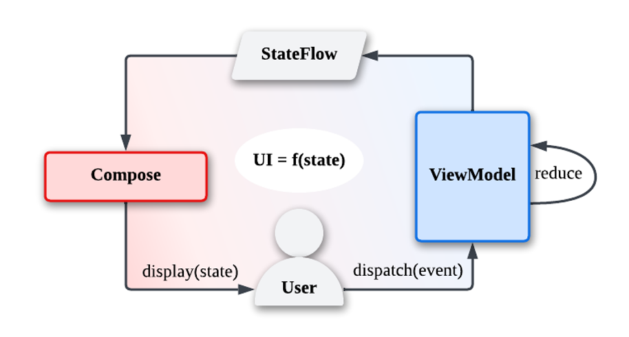

# Tetris

[中文介绍](https://github.com/Osiris-tevin/Tetris/blob/main/README.md) | English

## :scroll: Description

A tetris game fully built using [jetpack compose](https://developer.android.com/jetpack/compose).

- MVI architecture
- Simulate appearance of LCD screen
- Game sound and clock
- Inspired by [react-tetris](https://github.com/chvin/react-tetris/blob/master/README-EN.md)

#### Game Rules

- 100 points for 1 line, 300 points for 2 lines, 700 points for 3 lines, 1500 points for 4 lines;
- The drop speed of the box increases with the number of rows eliminated (one level for every 20 lines);

## :nut_and_bolt: MVI Architecture

