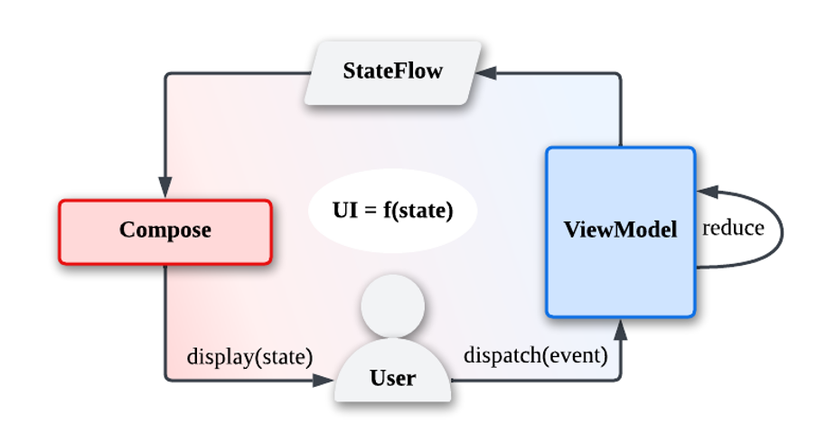

# Tetris

中文介绍 | [English](https://github.com/Osiris-tevin/Tetris/blob/main/README.en.md)

## :scroll: Description

基于[jetpack compose](https://developer.android.com/jetpack/compose)实现的俄罗斯方块游戏。

- 基于MVI架构
- 模拟液晶显示效果
- 多种游戏音效
- 致敬[react-tetris](https://github.com/chvin/react-tetris/blob/master/README-EN.md)

#### 游戏规则

- 一次消除1行得100分、2行得300分、3行得700分、4行得1500分；
- 方块掉落速度会随着消除的行数增加（每20行增加一个级别）；

## :nut_and_bolt: MVI Architecture

